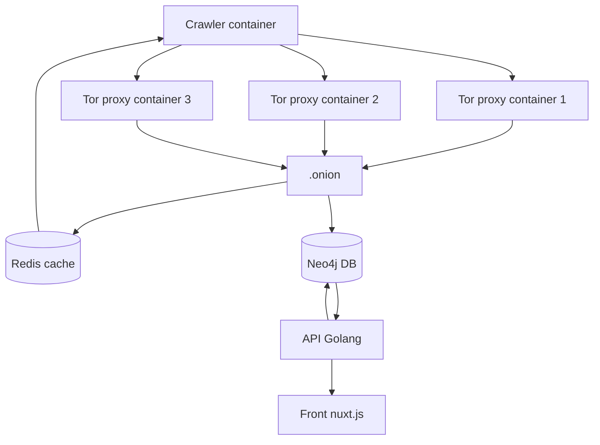
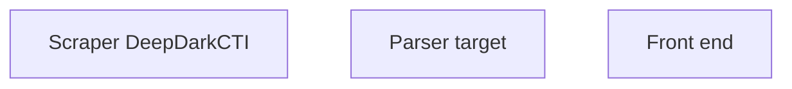

# BlueWhiteThreat
Ce projet est un crawler écrit en Go, conçu pour collecter, analyser et visualiser des informations sur les menaces provenant de sources du darkweb, avec une interface web dédiée permettant une visualisation simple et intuitive des données extraites.

Le système repose sur une architecture modulaire intégrant plusieurs mécanismes complémentaires :

**Crawler** : explore automatiquement les sources ciblées pour identifier des pages ou ressources pertinentes.

**Scraper** : extrait le contenu brut des pages identifiées (HTML, JSON, etc.).

**Parser** : transforme le contenu extrait en entités exploitables (IOCs, noms de malware, groupes, infrastructures, etc.).

**Redis** : gère la file d’attente des URLs à explorer, permettant un traitement asynchrone et scalable.

**MongoDB** : stocke les données extraites sous forme de documents structurés et flexibles.

**Neo4j** : modélise les relations entre les entités pour une analyse orientée graphe.

**Frontend web** : permet la consultation des menaces collectées, l’exploration des graphes d’interconnexion et l’analyse des entités.

Ce projet vise à fournir un outil de veille automatisée sur les menaces issues du darkweb, et à faciliter leur analyse contextuelle à travers une visualisation graphique et interactive.

#### Schémas Fonctionnel Crawler:

#### Schémas Fonctionnel Scraping, Parsing :

